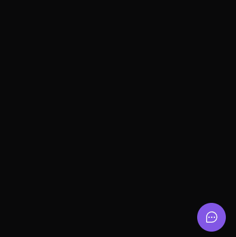

Link para acessar: <a href="https://nlw-feedback-widget-ochre.vercel.app/" target="_blank" >https://nlw-feedback-widget-ochre.vercel.app/</a>

## 💻 Projeto
Widget desenvolvido para recebimento de feedbacks, multi-plataforma.

## ✨ Tecnologias Front-End

-   [X] ReactJs
-   [X] Tailwindcss
-   [X] Typescript
-   [X] Axios
-   [X] Vercel

## ✨ Tecnologias Back-End

-   [X] NodeJs
-   [X] Prisma
-   [X] Jest
-   [X] Typescript
-   [X] Postgresql
-   [X] Railway

## :hammer_and_wrench: Features 

-   [X] - Envio de diferentes tipos de feedbacks
-   [X] - Multi-plataforma 

### NextLevel da aplicação(mudanças pessoais):

-   [X] - Tema Dark/Light
-   [X] - Responsividade da aplicação
-   [X] - Criar cards para exibir os feedbacks

## Executando o projeto

Acesse a pasta "server" e utilize o **npm install** para instalar as dependências do projeto.
Em seguida, inicie o servidor do projeto.

```cl
npm run start
```

Após iniciado o servidor, em outro terminal, retorne para a pasta anterior e inicie o projeto WEB.
```cl
npm run dev
```

<br />
