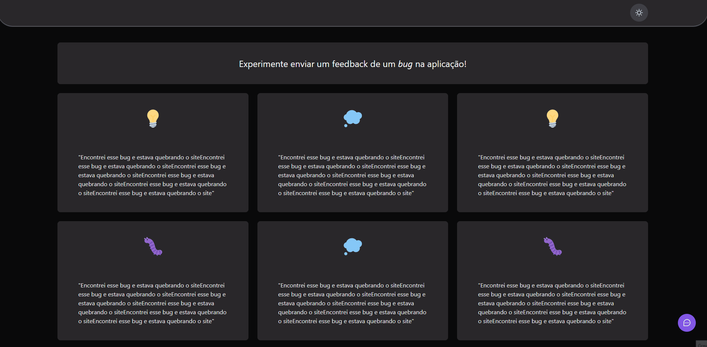

## 💻 Projeto
Widget desenvolvido para recebimento de feedbacks, multi-plataforma.

## ✨ Tecnologias Front-End

-   [X] ReactJs
-   [X] Tailwindcss
-   [X] Typescript
-   [X] Axios
-   [X] Vercel

## ✨ Tecnologias Back-End

-   [X] NodeJs
-   [X] Prisma
-   [X] Jest
-   [X] Typescript
-   [X] Postgresql
-   [X] Railway

## ✨ Tecnologias Mobile

-   [X] React Native
-   [X] React Native Svg e Svg Transform
-   [X] Expo
-   [X] Expo Google Fonts
-   [X] React Native Gesture Handler

## :hammer_and_wrench: Features 

-   [X] - Envio de diferentes tipos de feedbacks
-   [X] - Multi-plataforma 

### NextLevel da aplicação(mudanças pessoais):
-   [ ] - Tema Dark/Light
-   [ ] - Criar outras rotas da API
-   [ ] - Criar cards para exibir os feedbacks

## Executando o projeto

Acesse a pasta "server" e utilize o **npm install** para instalar as dependências do projeto.
Em seguida, inicie o servidor do projeto.

```cl
npm run start
```

Após iniciado o servidor, em outro terminal, retorne para a pasta anterior e inicie o projeto web.
```cl
npm run dev
```
 
 Para inicializar o projeto Mobile, basta acessar a pasta "mobile", e utilizar o **npm install** para instalar as dependências do projeto.
 Em seguida, inicie a aplicação.
 ```cl
expo start
```

<br />
